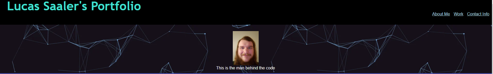

# Portfolio

## Description

This project was done as a bootcamp assignment to create a portfolio with advanced css.

## Table of Contents (Optional)

If your README is long, add a table of contents to make it easy for users to find what they need.

- [Usage](#usage)
- [Credits](#credits)
- [License](#license)

## Usage

Using the website is simple: it is one page, and there is a navigation bar at the top to jump to any specific section. You can find the website here: https://lucas-saaler.github.io/Portfolio/

## Credits

This website was coded from the ground-up by me.

## License

